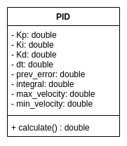
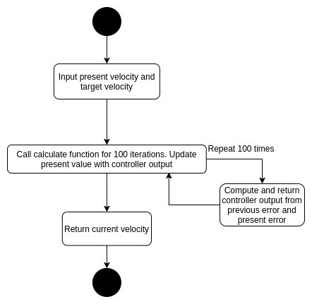

---

# Week 5: Test-Driven Development Assignment - ENPM 808X

## Overview

This repository pertains to the test driven development exercise. The group members of which are :

- Arunava Basu
- Shon Cortes
- Anubhav Paras
- Charu Sharma

## Part 1 
The members of the first pair for Part 1 of this repository are :
 - Arunava Basu (Driver)
 - Shon Cortes (Navigator
 
## Description
The design contains one class, PID. The main function takes the target velocity and present velocity as input and calls the calculate function of the PID class for 100 iterations.
The present voltage is updated with the controller output until it reaches within a margin of the target voltage. The UML class diagram is as follows : 

*Fig 1 :  UML class diagram*

The activity diagram is as follows : 

*Fig 2 :  Activity diagram*

### Steps to build 

    cd ...<path_to_directory>/
    mkdir build
    cd build
    cmake ..
    make
    
### Steps to run
    ...<path_to_directory>/app/shell-app
   
